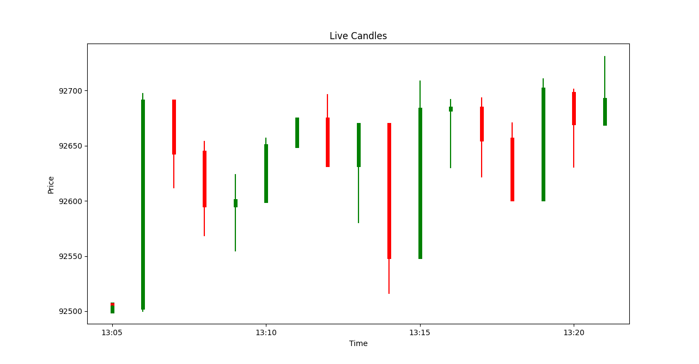

# 🚀 Real-Time Cryptocurrency Market Data Pipeline

A **pipeline** that ingests live cryptocurrency market data from Binance WebSocket, processes it through Apache Kafka, and enables real-time analytics and visualization.

**Built to demonstrate:** Stream processing • Event-driven architecture • Scalable data engineering • Real-time analytics


[Live Demo Video](link-if-you-have-one) | [Architecture Diagram](https://github.com/Mohamadbnz/BINANCE/edit/main/README.md#%EF%B8%8F-architecture)

---

## 🎯 Key Features

- ⚡ **Real-time streaming** with sub-second latency
- 🔄 **Event-driven architecture** using Apache Kafka
- 📊 **Live visualization** with candlestick charts
- 📈 **Scalable design** supporting multiple symbols/intervals
---

## 📁 **Project Structure**
```
BINANCE/
├── producer.py
├── consumer.py
├── visualizer.py
├── config.py
├── requirements.txt
└── README.md

```

---

## **Files Overview**

| File            | Description                                                        |
|-----------------|--------------------------------------------------------------------|
| `producer.py`   | Fetches live candle data from Binance and publishes it to Kafka.   |
| `consumer.py`   | Subscribes to the Kafka topic and processes candle messages.       |
| `visualizer.py` | Real-time visualization of incoming candle data.                   |
| `config.py`     | Central configuration for Kafka, topics, symbols, intervals.       |

---

## ⚙️ Installation & Setup

### Prerequisites
- Python 3.9 or higher
- Docker & Docker Compose (for Kafka)
- Git

### 1️⃣ Clone the repository
```bash
git clone git@github.com:Mohamadbnz/BINANCE.git
cd BINANCE
```

### 2️⃣ Install Python dependencies
```bash
# Create virtual environment (recommended)
python -m venv venv
source venv/bin/activate

# Install dependencies
pip install -r requirements.txt
```

### 3️⃣ Start Kafka with Docker
```bash
docker compose up -d
```
---

## 🚀 Running the Pipeline

### Start all components in separate terminals:

**Terminal 1: Producer**
```bash
python producer.py
```

**Terminal 2: Consumer**
```bash
python consumer.py
```

**Terminal 3: Visualizer**
```bash
python visualizer.py
```
Opens live candlestick chart in matplotlib window.

---

## 🏗️ Architecture
```
┌─────────────────────┐
│   Binance WebSocket │  (Live market data)
│   API (BTCUSDT 1m)  │
└──────────┬──────────┘
           │ candle updates
           ▼
    ┌──────────────┐
    │  Producer    │  (producer.py)
    │  • Connects  │
    │  • Validates │
    │  • Publishes │
    └──────┬───────┘
           │
           ▼
    ┌──────────────────────┐
    │   Apache Kafka       │
    │   Topic: candles_1m  │  (Message queue)
    │   • Persistence      │
    │   • Replay capability│
    └──────┬───────────────┘
           │
           ├─────────────────┐
           ▼                 ▼
    ┌──────────┐    ┌──────────────┐
    │Consumer  │    │ Visualizer   │
    │(Group 1) │    │ • Real-time  │
    │Storage │      │ • Candlestick│
    └──────────┘    └──────────────┘
```

**Design Principles:**
- **Decoupling**: Components communicate via Kafka, can be deployed independently
- **Scalability**: Add more consumers without affecting producer
- **Fault Tolerance**: Kafka persists messages if consumer fails
- **Replayability**: Can reprocess historical data from any point

    Visualizer is decoupled and customizable


## 📊 Sample Output

### Live Candlestick Visualization

*Real-time BTCUSDT 1-minute candles with volume bars*
